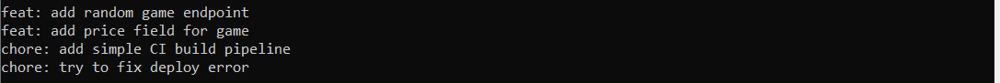

# Команды использованные в лабороторной и скриншоты результатов
## Задание №1
>- git instaweb
>- nano .git/description
>- docker run --name devtools-db -p 5432:5432 -e POSTGRES_USER=blackbox -e POSTGRES_PASSWORD=123456 -e POSTGRES_DB=postgres -d postgres
>- npx prisma generate && npx prisma db push
>- npx ts-node prisma/seed.ts

## Задание №2
>- git rebase -i HEAD~4
>- git cherry-pick 32098a
>- git branch -d ci

## Задание №3
>- git reflog
>- git branch old-master f95dd

## Задание №4
>- git blame -L 32,32 prisma/seed.tr

## Задание №5
>- npm run test
>- git bisect start
>- git bisect bad
>- git bisect good 15d2a

## Задание №6
>- git filter-branch --index-filter 'git rm -cached --ignore-unmatch .env' HEAD
>- git blame .env

## Задание №7
>- git rebase -r 15d2a11 --exec 'git commit --amend --author="David Atakishiev" <davidatak@icloud.com>'
>- git blame .env

## Задание №8
>- git config --global rerere.enable true 
>- git merge feature
>- git rerere status 
>- git rerere diff
>- git merge --continue
>- git commit -m 'chore:update README,md'
>- git reset --hard HEAD~1

## Задание №9
>- git log --all --graph

## Задание №10
>- sudo du -sh .git
>- git gs

## Задание №11
>-git add -p
>-git commit -m
>-git add .

